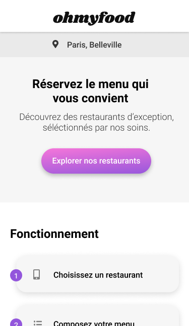

<!-- PROJECT LOGO -->
 

  

  <h3 align="center">OH MY FOOD</h3>

  

    Ohmyfood! est une entreprise de commande de repas en ligne.
     
    <a href="https://laury-thiallier.github.io/LauryTHIALLIER_3_08102021/"><strong>ALLER SUR LE SITE</strong></a>
  

<!-- ABOUT THE PROJECT -->
## À PROPOS DU PROJET :

### VERSION MOBILE :
  

    
  

### LANGUAGES / LIBRAIRIES / FONTS
* [HTML](https://github.com/Laury-THIALLIER/LauryTHIALLIER_3_08102021/search?l=html)
* [SCSS](https://github.com/Laury-THIALLIER/LauryTHIALLIER_3_08102021/search?l=scss)
* [FONTAWESOME](https://fontawesome.com)
* [SHRIKHAND](https://fonts.google.com/specimen/Shrikhand)
* [ROBOTO](https://fonts.google.com/specimen/Roboto)

<!-- GETTING STARTED -->
## PROJET OH MY FOOD

### SCÉNARIO :

Vous venez d’être recruté chez Ohmyfood!, en tant que développeur junior. Félicitations ! 

Ohmyfood! est une jeune startup qui voudrait s'imposer sur le marché de la restauration. L'objectif est de développer un site 100% mobile qui répertorie les menus de restaurants gastronomiques. En plus des systèmes classiques de réservation, les clients pourront composer le menu de leur repas pour que les plats soient prêts à leur arrivée. Finis, les temps d'attente au restaurant !

### IDENTITÉ :

Ohmyfood! est une entreprise de commande de repas en ligne. Notre concept permet aux
utilisateurs de composer leur propre menu et réduire leur temps d’attente dans les
restaurants car leur menu est préparé à l’avance. Plus de perte de temps à consulter la carte !

### PROPOSITION :

Nous souhaitons proposer à nos clients les menus de restaurants gastronomiques.
Développé à New-York dans un premier temps, nous souhaitons désormais élargir notre
concept à la capitale de la gastronomie : Paris.

### POSITIONNEMENT :

Nous nous positionnons sur un marché de niche, avec les restaurants luxueux des villes
dans lesquelles nous sommes établis. Nous souhaitons être identifiés comme une
entreprise proposant des services haut de gamme.

### CIBLE :

Classes moyennes et supérieures, connectées et souvent pressées, souhaitant déguster des
produits de qualité.

### IDENTITÉ GRAPHIQUE :
* Je te fournis deux maquettes : l’une desktop et l’autre mobile. Le site devra également être adapté aux tablettes. Sur ce support, tu es libre de faire les adaptations nécessaires avec la mise en page, tant qu’aucun élément n’est coupé et que le texte a une taille suffisante. Je te laisse choisir les breakpoints appropriés.
* Comme je ne savais pas de quels tailles et formats d’image tu avais besoin, j’ai exporté les images en différents formats. Je te laisse choisir le format le plus adapté par rapport à la résolution et au temps de chargement.
* Les icônes proviennent de la bibliothèque [Font Awesome](https://fontawesome.com). Les couleurs de la charte sont #9356DC , #FF79DA et #99E2D0
* La police du site est [Roboto](https://fonts.google.com/specimen/Roboto).

## MES OUTILS
#### ÉDITEUR DE CODE : [Visual Studio Code](https://code.visualstudio.com/)
#### NAVIGATEURS : [Brave](https://brave.com/fr/) / [Firefox Developer Edition](https://www.mozilla.org/fr/firefox/developer/)
#### OS : [Windows 10 Pro](https://www.microsoft.com/fr-fr/p/windows-10-pro/df77x4d43rkt?rtc=1&activetab=pivot:overviewtab)